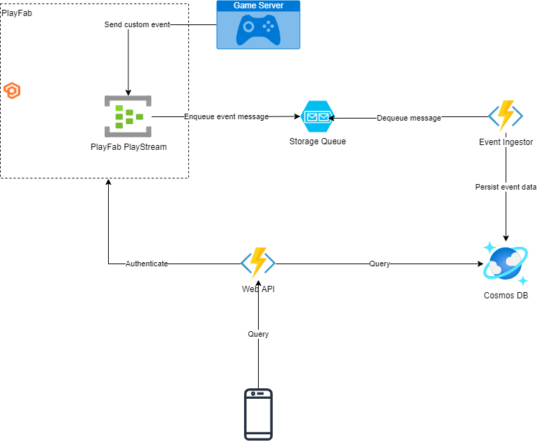

# PlayFabMatchHistoryExtension
The goal of this Project is to showcase how [Azure PlayFab](https://playfab.com/) can be extended by a scale able Match History with Azure. We wanted to make sure to integrate with Azure PlayFab as much as possible to feed into the built in PlayFab Analytics solution.

We only implemented a limited set of Query able statistics, as every game has its very own stats that are interesting to them. Our reference implementation should cover most of these use cases.

This extension is intended as a Proof of Concept and not intended for production use.

# Prerequisites
* [Azure Subscription](https://azure.microsoft.com/en-us/solutions/gaming/)
* [Azure Service Principal](https://docs.microsoft.com/en-us/azure/active-directory/develop/howto-create-service-principal-portal)
* [Terraform](https://terraform.io)
* [Azure PlayFab Account](https://playfab.com/)
* [.NET 6](https://dot.net)

# Development Prerequisites
* An [Azure Subscription](https://azure.microsoft.com/en-us/solutions/gaming/)
* [.NET 6 SDK](https://dot.net)
* CosmosDB, either on Azure, or using the [CosmosDB Emulator](https://docs.microsoft.com/en-us/azure/cosmos-db/local-emulator?tabs=ssl-netstd21)
* Azure BlobStorage, or use [Azurite](https://github.com/Azure/Azurite) as a local storage emulator.

# Deploying
## Terraform
### Environment Variables
| Name     | Description    |
|----------|----------|
| `AZURE_SUBSCRIPTION_ID` | Azure Subscription ID; `id` property when executing `az account show` |
| `AZURE_TENANT_ID` | Azure Tenant ID; `tenantId` property when executing `az account show` |
| `TF_VAR_pf_title_id` | A PlayFab Title ID to authenticate against |
| `TF_VAR_pf_developer_secret` | A PlayFab Developer Secret for the above Title |

### Init Terraform:

Before initializing, set up a copy of `example.backend.config.tf`, and configure an existing storage account and container to be used for Terraform state management.

Then, init:

    terraform init -backend-config='.\config\backend.local.config.tf'

### Apply
    
    terraform apply

## Running Locally
If you want to run this locally it is possible if you set the environment variables for "pf_titleId" and "pf_secret" which is requiered by the GameServerMock and the PublicAPI to talk to the PlayFab Admin APIs.

# Architecture

We use custom PlayFab Player events that are generated by the "GameServerMock" project which is simulating a game server that submits match finished events for Players that participated in the session. 

This means that we are expecting the game server to publish one "player_finished_match" event for every player that attended at the end of a match. 

 We are aware, that integrating this into a C++ / UE / Unity server will require outbound HTTPS connection towards PlayFab. We used the PlayFabSDK but you could build a optimized versions of the web requests that we used.

 ## Getting Events into Azure
 The next step is to register a Queue triggered Azure function that takes our custom event and writes it into our Data store. We decided to use CosmosDb as the serverless SKU enables simple testing and scale abilty. As partition key we are using the PlayFab Master Player Id, which gives every Player their own partition. When looking for the History of a Player this partition schema makes sense and enables us to scale. Be aware that this might need optimization for high throughput players that are attracting more than ~20k history request a second.
## Deliver the Data to the client
The PublicAPI function project is used to authenticate every request to make sure that only authenticated PlayFab users can query it. Now we only need to query our CosmosDb for the match data of a player and return it.

